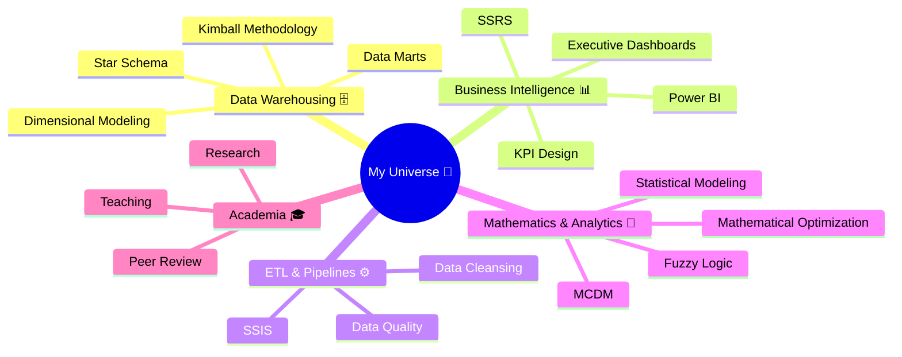
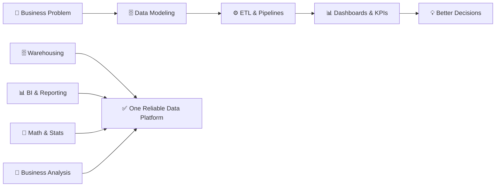

<!-- ⌨️ Typing animation -->
<p align="center">
  
</p>

<!-- 🔢 Live profile badges -->
<p align="center">
  
  <a href="https://github.com/HamidHassasii?tab=followers">
    
  </a>
</p>

---

<!-- ══════════════════════════ ABOUT ══════════════════════════ -->
## 👨‍💻 About Me

```bash
$ whoami
hamid-hassasi

$ cat ~/profile.json
{
  "name":       "Hamid Hassasi",
  "role":       ["Senior BI & Data Warehouse Specialist", "University Lecturer"],
  "education":  "PhD in Applied Mathematics — IAUCTB",
  "experience": "14+ Years",
  "focus":      ["Data Warehousing", "Dimensional Modeling", "BI & Analytics"],
  "building":   "Kimball data marts · ETL pipelines · Executive dashboards",
  "tools":      ["SQL Server", "T-SQL", "SSIS", "SSAS", "Power BI", "DAX", "Python"],
  "motto":      "Model the business · Trust the data · Deliver the decision"
}

$ sudo make impact
▸ modeling warehouses........ done ✓
▸ tuning queries............. 15min → 4min ✓
▸ delivering dashboards...... always ✓
```

I design and build **enterprise data warehouses, ETL pipelines, and BI dashboards** — backed by a strong foundation in **applied mathematics, statistics, and optimization**. From requirements gathering and Kimball-based data modeling to ETL development, data quality, and production support, I turn complex data into reliable KPIs and decision-support solutions.

---

<!-- ══════════════════════════ SNAPSHOT ══════════════════════════ -->
## 📊 Career Snapshot

<p align="center">
  
  
  
  <br/>
  
  
  
</p>

---

<!-- ══════════════════════════ TECH STACK ══════════════════════════ -->
## 🧰 Tech Stack

<p align="center">
  
  
  
  
  
  
  
  
  
</p>

<details>
<summary>🎯 <b>Full Arsenal & Matrix — click to expand</b></summary>

<br>

### Query & Languages

<p>
  
  
  
  
  
</p>

### Microsoft BI Stack

<p>
  
  
  
  
  
  
  
</p>

### Data & Analytics

<p>
  
  
  
  
  
</p>

### Tools & Platforms

<p>
  
  
  
  
  
</p>

<br>

### 🌐 The Full Matrix

| Area | Technologies |
|------|--------------|
| 🗄️ **Data Warehousing** | Kimball Methodology · Dimensional Modeling · Fact/Dimension · Data Marts · Star Schema |
| ⚙️ **ETL & Integration** | SSIS (100+ packages) · ETL Pipelines · Data Cleansing · pyodbc · Scheduled Jobs |
| 📊 **BI & Reporting** | Power BI · SSRS · Report Builder · DAX · KPI Design · Executive Dashboards |
| 🧠 **Analytics Engine** | SSAS · MDX · Cubes · OLAP |
| 🗃️ **Databases & Query** | SQL Server · T-SQL · Execution Plans · Indexing · Query Tuning · MongoDB · PL-SQL |
| 🐍 **Programming** | Python · pyodbc · C# (basic) |
| 📈 **Math & Statistics** | Mathematical Optimization · Statistical Modeling · SPSS · Advanced Excel |
| 🧮 **Decision Science** | MCDM · Fuzzy Logic · Decision Analysis · Operations Research |
| 💼 **Business Analysis** | BABOK · Requirements Engineering · Process Modeling · ERP · Insurance Domain |
| 🛠️ **Tools** | Git · Visual Studio · REST API · QlikView (basic) · Figma (basic) |

</details>

---

<!-- ══════════════════════════ INTERESTS ══════════════════════════ -->
## 🧠 Areas of Interest



---

<!-- ══════════════════════════ BUILDING ══════════════════════════ -->
## 🔥 What I Love Building

<p align="center">
  
  
  
  
  <br/>
  
  
  
  
</p>

---

<!-- ══════════════════════════ MINDSET ══════════════════════════ -->
## 📈 Engineering Mindset

I enjoy working across the full path from **business problem → data model → ETL → dashboard → decision** — not just individual reports or tables, but complete systems where everything works as one reliable data platform:



---

<!-- ══════════════════════════ ACHIEVEMENTS ══════════════════════════ -->
## 🏆 Highlights & Achievements

- 🥇 **Distinguished Student Awardee** — 4th Exceptional Talents Festival, University of Qom (2008)
- 📝 **Peer Reviewer** — Interdisciplinary Journal of Management Studies (IJMS)
- 🎓 **13+ Years of University Teaching** — Statistics, Linear Algebra, Fuzzy Logic, Decision Analysis & AI at Islamic Azad University (Central Tehran Branch)

<details>
<summary>📚 <b>Publications — click to expand</b></summary>

<br>

- **Adjacency-based local top-down search method for finding maximal efficient faces in multiple objective linear programming** *(2018)*
- **Solving a tri-criteria best path problem using the fuzzy decision making** *(2016)*

</details>

---

<!-- ══════════════════════════ EXPLORING ══════════════════════════ -->
## 🚀 Currently Exploring

| Focus Area | Progress |
|------------|----------|
| 🧮 Advanced DAX & Power BI Modeling | `█████████░` |
| ⚡ Large-Scale Warehouse Performance Tuning | `████████░░` |
| 🐍 Python for Data Engineering | `███████░░░` |
| 🤖 AI & Data Mining in BI | `██████░░░░` |
| 📊 Advanced Statistics & Optimization | `███████░░░` |
| ☁️ Cloud Data Platforms | `█████░░░░░` |
| 🌊 Modern Lakehouse Architectures | `████░░░░░░` |

<sub>*bars measured in pure enthusiasm, not science 📏😄*</sub>

---

<!-- ══════════════════════════ QUOTE ══════════════════════════ -->
## 💬 Wisdom of the Day

<p align="center">
  
</p>

---

<!-- ══════════════════════════ CONTACT ══════════════════════════ -->
## 📫 Connect With Me

<p align="center">
  <a href="mailto:HamidHassasii@gmail.com">
    
  </a>
  <a href="https://github.com/HamidHassasii">
    
  </a>
  <!-- ⚠️ Replace with your actual LinkedIn profile URL -->
  <a href="https://www.linkedin.com/in/hamidhassasi">
    
  </a>
</p>

<p align="center">
  <i>“Model the business.<br>
  Trust the data.<br>
  Keep the warehouse solid.”</i>
</p>

<!-- ══════════════════════════ FOOTER ══════════════════════════ -->

